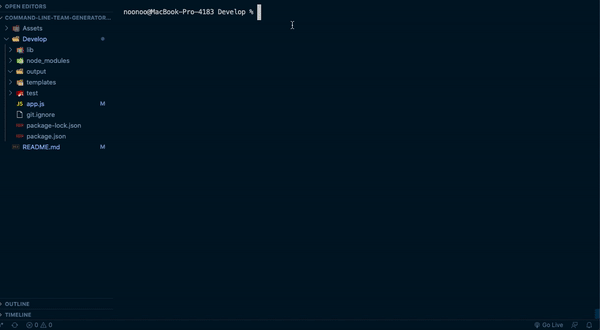

# Command-Line-Team-Generator-OOP

## Objective

Create a Node Command-Line Interface (CLI) that takes in infromation about employees and generates an HTML webpage that displays summaries for each individual.

## Table of Contents

* [Objective](#objective)
* [User Story](#user-story-concept)
* [Brief & Acceptance Criteria](#brief-and-acceptance-criteria)
* [Video Walkthrough](#video-walkthrough)
* [Tools Implemented](#tools-implemented)
* [Installation](#installation)
* [Challenges](#challenges)
* [Additional Resources](#additional-resources-for-finished-project)

## User Story Concept

```md
As a manager
I want to generate a webpage that displays my team's basic info
so that I have quick access to emails and GitHub profiles
```

## Brief & Acceptance Criteria

```md
GIVEN a command-line application that accepts user input
THEN I (as the team manager) am prompted for my name, ID, email, and office number
THEN I am prompted with a list of team members to select to be added
WHEN I select Engineer for the employee type 
THEN I am prompted for the employee name, ID, email, and GitHub profile
WHEN I select Intern for the employee type
THEN I am prompted for the employee name, ID, email, and school name
WHEN I am done adding team members
THEN a HTML file will be created that displays the team roster based on the information provided
```

## Video Walkthrough

The following video demonstrates the functionality of the README generator:




## Tools Implemented

* JavaScript
* Node.js
* path, fs, inquirer, joi

## Installation

* `npm install jest inquirer joi`

## Challenges

* Email Validatation <br>
    **Solution:** joi data validator for JavaScript

## Additional Resources for Finished Project

* [Joi Validataion](https://joi.dev/api/?v=17.3.0)
* [Exiting Node Process](https://nodejs.dev/learn/how-to-exit-from-a-nodejs-program)